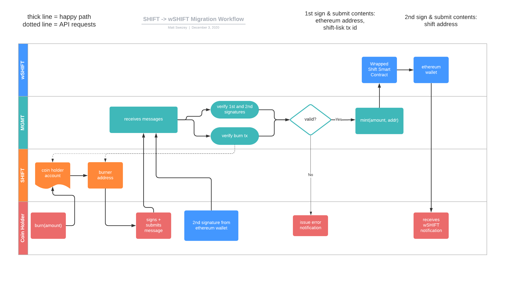

# Name: `Wrapped Shift` Symbol: `wSHIFT`
### ERC-20 Token 
### Blockchain Network: `Ethereum mainnet`

## Purpose
1. Provide greater outreach to future users of ShiftNrg's Phoenix platform via Uniswap's dex and others alike
2. Assist in the migration from ShiftNrg's Lisk-based blockchain to ShiftNrg's new Substrate-based blockchain
3. `PENDING` - operate as a 2-way bridge when paired with ShiftNrg's new Substrate-based blockchain (WIP)

# Token Info
```
Name: Wrapped Shift
Symbol: wSHIFT
*Decimals: 18
**Supply Multiplier: 10x
```

## Token Features
* ***Capped via `CAPPED_ROLE`
* Burnable via `BURNER_ROLE`
* Mintable via `MINTER_ROLE`
  * customized `multiMint(address[], amounts[])` function created to support minting in batches
* Pauseable via `PAUSER_ROLE`

Read more about roles [here](./ROLES.md)


### Notes:
* *: Lisk-based Shift has decimals of 8 places.
* **: Migration to `Substrate Shift` or `Wrapped Shift` will include a 10x supply increase 
  * This 10x supply increase occurs off-chain. The smart contract contained in the repo does not make that calculation.
* ***: Cap is adjustable based on a dedicated role `CAPPED_ROLE`

### Example: 10x Increase Scenarios

```
// Previous (original) balances
Alice: 50.00 SHIFT
BOB:  100.00 SHIFT
```

1. Alice migrates her tokens to Wrapped Shift (not active; coming soon)
2. Bob migrates his tokens to Substrate-based Shift (not active)
   

```
Alice: 500.00 wSHIFT
Bob: 1,000.00 SHIFT (Substrate chain)
```

Breaking it down further:
```
old SHIFT -> Substrate SHIFT: 10x
old SHIFT -> wrapped SHIFT: 10x
Wrapped SHIFT -> Substrate SHIFT: 1x
```

As you can see, the first two migrations included a 10x change in balance.
The third one did not, as the 10x increase already occurred when going from (old) SHIFT -> wSHIFT.
The final result, at the time of this writing, will be the following: 

`~14MM SHIFT -> ~140MM SHIFT` - Total Estimated Supply

# Migration Strategy: `SHIFT -> wSHIFT` (WIP)
This portion is currently being built. Steps and details may change before go-live.

* The migration from (old) SHIFT to wSHIFT is a 3 step process:
  1. Burn SHIFT by sending one's SHIFT to the designated burner address (Status: `active` on `testnet`; `not active` on `mainnet`)
  2. Submit a signed message, from the account used in step 1, to `Shift Community Project` for processing
  3. Submit a signed message to `Shift Community Project`, from one's Ethereum account, to confirm ownership of the designated address signed in step 2

### Notes
* The accounts must be the same in steps 1 & 2 above.
* The account designated to receive wSHIFT (step 2) must be the same account in step 3.
* The burner address that receives the SHIFT funds is an invalid address due to Lisk specifications (TODO: link source). In short, meaning no one holds the private key to this address nor would transactions be allowed to come out of this address if ever a private key "could" exist. Here by making this address a prime candidate to burn tokens.
* This migration is a one-way bridge. You cannot go back to (old) SHIFT from wSHIFT. In the near future, a bridge will open up to allow token holders to migrate their wSHIFT to (Substrate) SHIFT once mainnet launches. Dates on this TBD.


Here's a high level workflow illustration. Note: step 3 from above is missing and will be added.
* This repository represents the blue swim-lane below labeled `wSHIFT`


# Getting started
### Run Locally
```
// use the supported version of Node.js
nvm use

// install dependencies
yarn 

// launch Truffle's develop console
yarn develop

// then, compile & deploy contracts to local ganache test rpc
migrate

// then, run test cases
test

// exiting Truffle console
.exit
// or ctl+c 
```

### Solidity Coverage Report

```
// execute solidity-coverage
yarn coverage
```

```
  86 passing (19s)

------------------------|----------|----------|----------|----------|----------------|
File                    |  % Stmts | % Branch |  % Funcs |  % Lines |Uncovered Lines |
------------------------|----------|----------|----------|----------|----------------|
 contracts/             |      100 |      100 |      100 |      100 |                |
  WrappedShift.sol      |      100 |      100 |      100 |      100 |                |
 contracts/oz-modified/ |      100 |      100 |      100 |      100 |                |
  ERC20Capped.sol       |      100 |      100 |      100 |      100 |                |
------------------------|----------|----------|----------|----------|----------------|
All files               |      100 |      100 |      100 |      100 |                |
------------------------|----------|----------|----------|----------|----------------|
```

## Tools Utilized
* Truffle
* OpenZeppelin
* GanacheRPC
* Solidity-Coverage

## Best Practices & Knowledge
1. https://solidity.readthedocs.io/en/v0.6.12/
2. https://www.trufflesuite.com/docs
3. https://docs.openzeppelin.com/openzeppelin/
4. https://ethereum.stackexchange.com/

# Audit Report
* `PENDING`